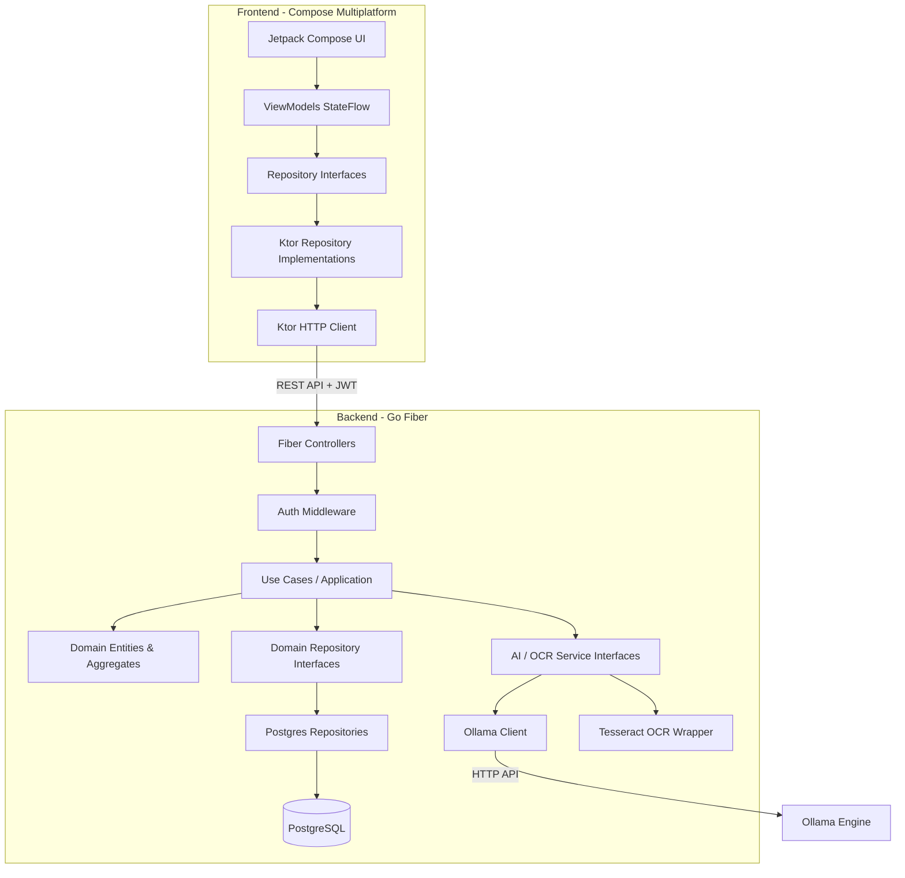

# 🛡️ AXION — Enterprise Financial Intelligence Platform

<p align="center">
  
</p>

<p align="center">
  <a href="https://github.com/iuriGaldino/Axion/actions"></a>
  <a href="https://go.dev/"></a>
  <a href="https://kotlinlang.org/"></a>
  <a href="https://www.postgresql.org/"></a>
  <a href="https://sonarcloud.io/"></a>
  <a href="LICENSE"></a>
</p>

---

## 📖 Overview

**Axion** is an enterprise-grade personal finance management platform designed for high performance, modularity, and security. Built with a robust Go backend adhering to **Clean Architecture** and **Domain-Driven Design (DDD)**, and a modern **Kotlin Compose Multiplatform** frontend, Axion offers real-time financial tracking, automated OCR receipt processing, AI-driven budget insights, and comprehensive infrastructure monitoring.

---

## 🏛️ System Architecture

Axion is structured as a monorepo following strict Clean Architecture and DDD principles to ensure separation of concerns, testability, and technological adaptability.



### Key Pillars
*   **Domain-Driven Design (DDD):** Pure business logic isolated within the `domain` package with zero external dependencies.
*   **Clean Architecture:** Strict unidirectional dependencies: `Interface/API` -> `Application/UseCases` -> `Domain`.
*   **Dependency Injection:** Clean compile-time interface enforcement in Go, and Koin-ready structure in Kotlin.

---

## 🛠️ Technology Stack

### Backend (Go 1.22)
*   **Web Framework:** [Fiber v2](https://gofiber.io/) (High-performance Express-like routing)
*   **Database:** PostgreSQL 15 + native driver `lib/pq`
*   **Caching & Sessions:** Redis 7 (Structured cache and session-ready)
*   **Logging & Metrics:** Zerolog (Structured JSON logging) & Prometheus metrics middleware
*   **Security:** Argon2id (State-of-the-art password hashing) + JWT (Access/Refresh Token authorization)

### Frontend (Kotlin Compose Multiplatform)
*   **UI Engine:** Jetpack Compose Multiplatform (Shared UI for Android/Desktop)
*   **Networking:** Ktor Client (Content Negotiation + Kotlinx Serialization)
*   **State Management:** Kotlinx Coroutines StateFlow
*   **Dependency Injection:** Koin (DI framework setup)

### Infrastructure & DevOps
*   **Gateway:** Traefik v2.10 (Reverse Proxy & SSL termination)
*   **Observability:** Prometheus (metrics scraping), Grafana (visualization), Loki (log aggregation)
*   **CI/CD:** GitHub Actions (automated testing and build pipelines)

---

## 📂 Project Structure

```directory
Axion/
├── .github/                  # GitHub Actions CI/CD workflows
├── backend/                  # Go Backend Application
│   ├── cmd/api/              # Application entry point (main.go)
│   └── internal/             # Clean Architecture Layers
│       ├── domain/           # Entities, Aggregates & Interfaces
│       ├── application/      # Use Cases & DTOs
│       ├── infrastructure/   # DB Repositories, AI, OCR & Security
│       └── interface/        # Handlers (Controllers) & Middlewares
├── frontend/                 # Kotlin Compose Multiplatform App
│   └── composeApp/
│       └── src/commonMain/   # Shared Kotlin logic and screens
├── infrastructure/           # Global Infrastructure Configurations
│   ├── db/                   # Database schemas and migrations
│   └── monitoring/           # Prometheus, Loki & Grafana configurations
├── scripts/                  # Utility scripts for local setup
├── docker-compose.yml        # Orchestration configuration for local development
└── Makefile                  # Task automation commands
```

---

## 🚀 Quick Start

### Prerequisites
*   [Docker & Docker Compose](https://www.docker.com/)
*   [Go 1.22+](https://go.dev/) (for local backend development)
*   [JDK 17](https://adoptium.net/) (for frontend builds)

### 1. Configuration
Clone the repository and copy the environment variables template:
```bash
cp .env.example .env
```
Ensure you adjust `JWT_SECRET` and DB credentials if running outside Docker.

### 2. Upgrading Infrastructure
Use the provided `Makefile` to stand up the local environment (PostgreSQL, Redis, Traefik, Prometheus, Grafana, Loki):
```bash
make up
```

This starts the entire stack. Verify the database initialized correctly via:
```bash
make db-shell
```

---

## 🐳 Docker Deployment

The system is configured to run fully containerized. The `docker-compose.yml` mounts:
*   **Traefik API Gateway** at `http://localhost:80` (routes `/api` to the backend)
*   **Go REST API** at `http://localhost:8080` (accessible via Traefik gateway)
*   **PostgreSQL** database at `localhost:5432` with persistent volume `postgres_data`
*   **Redis** cache instance at `localhost:6379`
*   **Prometheus** dashboard at `http://localhost:9090`
*   **Grafana** metrics visualizer at `http://localhost:3000` (default user/pass: `admin/admin`)

---

## 💻 Local Development

### Running the Backend
To start the Go backend server locally with hot reloading (requires `air` installed):
```bash
cd backend
go run cmd/api/main.go
```
The server will run on `http://localhost:8080`.

### Running the Frontend
To run the Compose Multiplatform Desktop app:
```bash
cd frontend
./gradlew run
```

### Running Backend Tests
Execute unit and usecase tests with coverage analysis:
```bash
make test
```

---

## 📊 Observability & Monitoring

The Axion stack is configured for enterprise-grade observability:
*   **Structured Logs:** The backend logs in JSON format using `zerolog`, feeding into Grafana Loki.
*   **APM Metrics:** Fiber-prometheus collects request totals, error rates, and latencies, scraping every 15s.
*   **Alerting Rules:** Configured rules in `alert_rules.yml` trigger alerts when API error rate exceeds 5% or 95% latency exceeds 500ms.

---

## 🧠 Artificial Intelligence (AI Engine)

Axion integrates with a local **Ollama** engine for processing transaction patterns and providing financial recommendations:
*   **Engine:** Ollama running `qwen:3b` or `deepseek-v2`
*   **Feature:** The `/api/v1/insights` endpoint queries recent transaction history, builds a context prompt, and streams insights back to the client.
*   **Configuration:** Inject the `OLLAMA_URL` environment variable to configure the connection.

---

## 🔍 OCR Receipt Processing

Receipt scanning is designed around the **Tesseract OCR** engine:
*   **Library:** Gosseract (Go wrapper for Tesseract C++ API)
*   **Dockerfile Execution:** Auto-installs `tesseract-ocr-dev` and `leptonica-dev` in Alpine Linux during container build stages.
*   **API Service:** `/api/v1/ocr` accepts receipt image uploads and extracts textual metadata for transaction parsing.

---

## 🗺️ Roadmap

- [x] Clean Architecture Backend Skeleton
- [x] Database migrations & schema setup
- [x] Dockerization & Traefik Reverse Proxy configuration
- [x] Integration with Prometheus and Grafana
- [ ] Implement Koin Dependency Injection on Frontend
- [ ] Connect Frontend ViewModels to real Ktor client calls
- [ ] Integrate real Tesseract OCR processing library inside Go
- [ ] Open Finance API integration (Pluggy / Belvo)
- [ ] Implement MFA and Redis-backed active sessions

---

## 🤝 Contributing

Contributions are welcome! Please read [CONTRIBUTING.md](CONTRIBUTING.md) and [CODE_OF_CONDUCT.md](CODE_OF_CONDUCT.md) before submitting pull requests.

---

## 📄 License

This project is licensed under the MIT License - see the [LICENSE](LICENSE) file for details.
