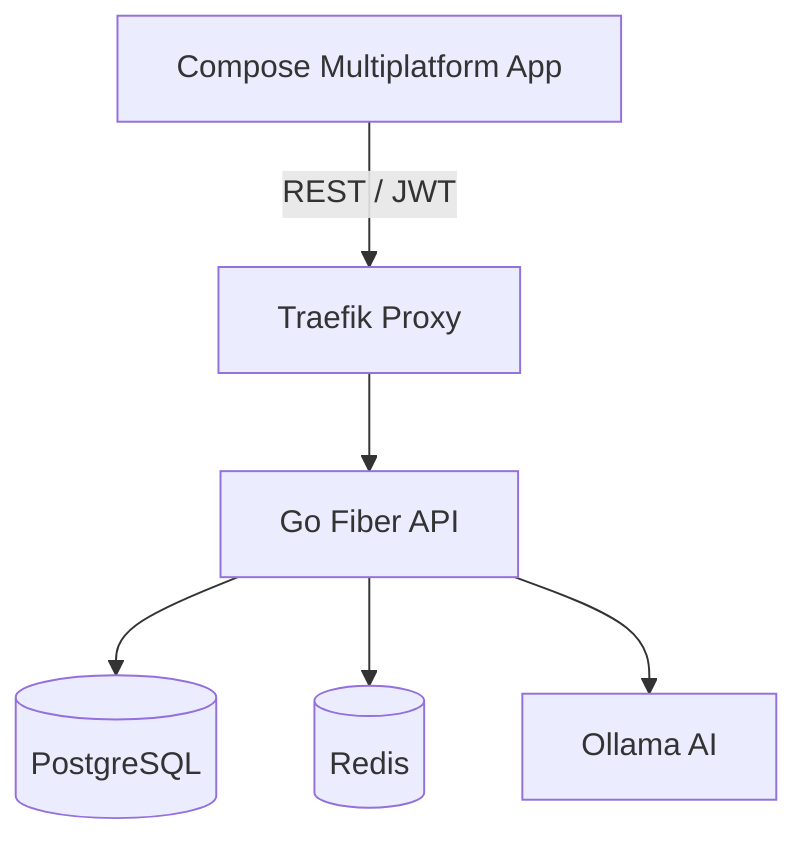
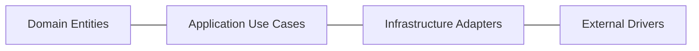

# Diagramas de Arquitetura AXION

## Arquitetura de Sistema

```mermaid
graph TD
    Client[Compose Multiplatform App] -->|REST / JWT| Gateway[Traefik Proxy]
    Gateway --> API[Go Fiber API]
    API --> DB[(PostgreSQL)]
    API --> Cache[(Redis)]
    API --> AI[Ollama AI]
```

## Estrutura Clean Architecture (Backend)

```mermaid
graph LR
    Entities[Domain Entities] --- UC[Application Use Cases]
    UC --- Adapters[Infrastructure Adapters]
    Adapters --- Drivers[External Drivers]
```
